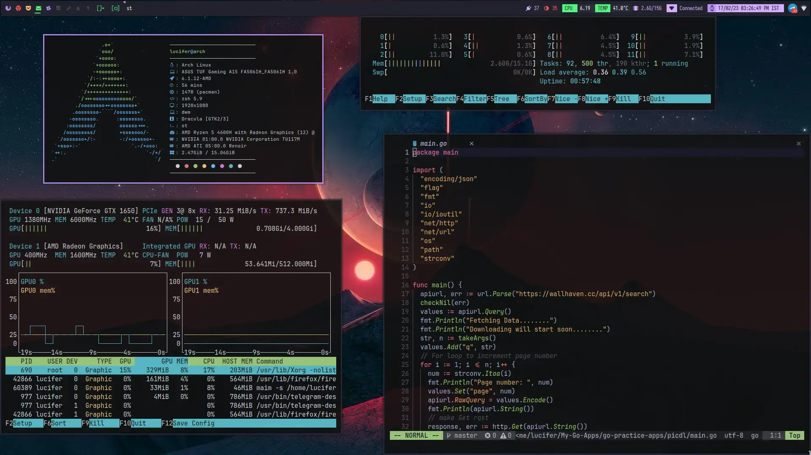

+++
author = "Sumit Dhiman"
title = "Archfire: Archlinux based linux distribution"
date = "2023-02-14"
description = "Archlinux based custom distribution for my own likings."
tags = [
    "C++",
    "Arch Linux",
    "Linux/Unix",
    "Sys Admin"
]
categories = [
    "Coding",
    "syntax",
]
series = ["Linux/Unix"]
aliases = ["My Custom Distribution"]
+++

For my own usage, I created Archfire, a custom distribution based on Arch Linux.
It comes with the pre-installed and pre-configured XFCE desktop environment.
It provides the Calamares installer, which makes installing Arch Linux simple.
Due to already installed drivers, it is already compatible with PCs that use Nvidia graphics.
It includes my unique dotfiles for Neovim, Ranger, and Alacritty. 

<a href="https://archfire.sourceforge.net" target="_blank"><button style="
padding: 13px;
  padding-right: 13px;
  padding-left: 13px;
font-size: 19px;
background-color: #ff0046;
border: 0px;
border-radius: 23px;
color: white;
padding-left: 21px;
padding-right: 21px;
  margin-left: 34%;
  margin-right: 34%;
}
">Download Archfire</button></a>

 

### Future goals:
- Adding  multiple Desktop environments.
- Adding support for multiple hardwares.
- Also adding Tilling windows managers like DWM, AwesomeWM, I3, etc.
